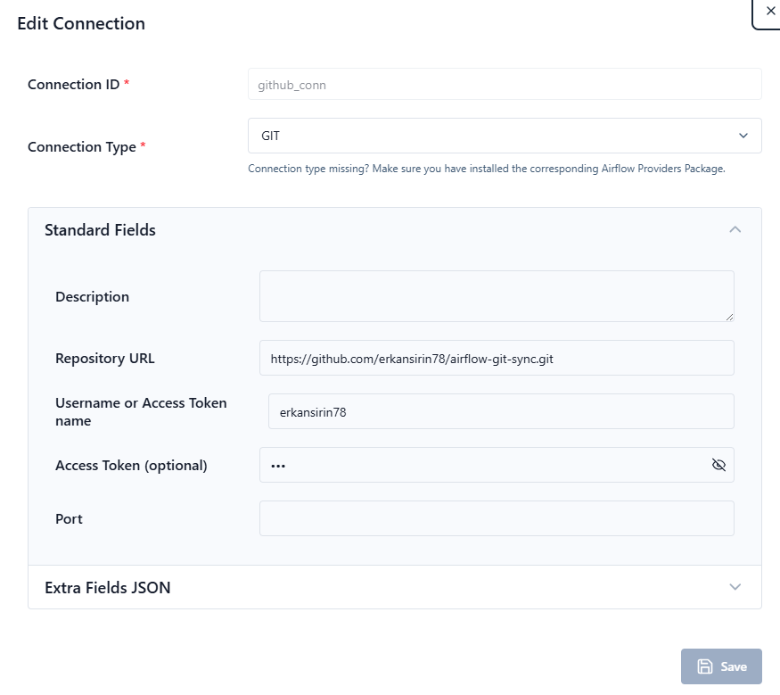

## 1. Create a repo
- Open GitHub
- Create new repo. In my case repo name: `airflow-git-sync`
- Make sure it is private
- Generate a token or use existing one.

## 2. Configure Airflow 
- Setting the right Airflow user
On Linux, the quick-start needs to know your host user id and needs to have group id set to 0. Otherwise the files created in dags, logs, config and plugins will be created with root user ownership. You have to make sure to configure them for the docker-compose:
```bash
mkdir -p ./dags ./logs ./plugins ./config
echo -e "AIRFLOW_UID=$(id -u)" > .env
```
- In docker-compose.yaml under  &airflow-common-env service
```yaml
AIRFLOW__DAG_PROCESSOR__DAG_BUNDLE_CONFIG_LIST: '[{"name":"erkan_github_repo","classpath":"airflow.providers.git.bundles.git.GitDagBundle","kwargs":{"tracking_ref":"main","git_conn_id":"github_conn","repo_url":"https://github.com/erkansirin78/airflow-git-sync.git","subdir":"dags"}}]'
```
- Object storage: this stack uses **RustFS** (S3-compatible drop-in for MinIO).
  - Console / S3 endpoint: http://localhost:9000 (S3 API), http://localhost:9001 (console)
  - Credentials are set inline in `docker-compose.yaml` under the `rustfs` service:
    - `RUSTFS_ACCESS_KEY=dataops`
    - `RUSTFS_SECRET_KEY=Ankara06`
  - No `.env` entries needed for object storage.
## 2.1 Enable HTTPS on the API server (do this BEFORE first `docker-compose up`)
Airflow 3's API server has native TLS support — set `AIRFLOW__API__SSL_CERT` and `AIRFLOW__API__SSL_KEY`, the port stays `8080`, the scheme switches to `https`. Doing this before the first `up` avoids tearing the stack down later.

### 2.1.1 Generate a self-signed cert
```bash
mkdir -p ./config/certs
openssl req -x509 -nodes -days 365 -newkey rsa:2048 \
  -keyout ./config/certs/airflow.key \
  -out    ./config/certs/airflow.crt \
  -subj "/CN=localhost" \
  -addext "subjectAltName=DNS:localhost,DNS:airflow-apiserver,IP:127.0.0.1"
chmod 644 ./config/certs/airflow.crt
chmod 640 ./config/certs/airflow.key
```
The `./config` directory is already mounted into the containers at `/opt/airflow/config`, so no extra volume is needed.

### 2.1.2 Update `docker-compose.yaml`
Under `x-airflow-common` → `environment:` (i.e. `&airflow-common-env`), add:
```yaml
AIRFLOW__API__SSL_CERT: /opt/airflow/config/certs/airflow.crt
AIRFLOW__API__SSL_KEY:  /opt/airflow/config/certs/airflow.key
# scheduler/dag-processor/workers must reach the API server over TLS now
AIRFLOW__CORE__EXECUTION_API_SERVER_URL: 'https://airflow-apiserver:8080/execution/'
# trust the self-signed cert from inside the containers
REQUESTS_CA_BUNDLE: /opt/airflow/config/certs/airflow.crt
SSL_CERT_FILE:      /opt/airflow/config/certs/airflow.crt
```
Update the `airflow-apiserver` service healthcheck to use HTTPS:
```yaml
healthcheck:
  test: ["CMD", "curl", "--fail", "-k", "https://localhost:8080/api/v2/version"]
```

### 2.1.3 Access (after step 3)
- Browser: https://localhost:8080  (accept the self-signed cert warning)
- CLI:     `curl -k https://localhost:8080/api/v2/version`

### Notes
- The port does **not** change — still `8080`, just TLS now.
- For a "real" cert without browser warnings, the cleaner production pattern is to put nginx/Caddy/Traefik in front and terminate TLS there, leaving the API server on plain HTTP behind it.
- To trust the self-signed cert system-wide on your host, import `./config/certs/airflow.crt` into your OS/browser trust store.

## 3. Docker compose up
```bash
docker-compose up --build -d
```
## 4. Create the `github_conn` Git connection
The `AIRFLOW__DAG_PROCESSOR__DAG_BUNDLE_CONFIG_LIST` env var references `"git_conn_id":"github_conn"`. The dag-processor will fail until this connection exists.

### 4.1 Option A — Web UI
1. Log in to https://localhost:8080 (default user/pass: `airflow` / `airflow`).
2. Go to **Admin → Connections → +** (Add a new record).
3. Fill in:
   - **Connection Id**: `github_conn`
   - **Connection Type**: `Git`  *(provided by `apache-airflow-providers-git`; if you don't see it, check that the provider is installed in the image)*
   - **Host**: `https://github.com/erkansirin78/airflow-git-sync.git`  *(or just `github.com` — the bundle's `repo_url` is the source of truth)*
   - **Login**: your GitHub username (only needed for private repos)
   - **Password**: GitHub Personal Access Token (PAT) with `repo` scope (only needed for private repos)
4. **Save**, then click **Test** to verify.



### 4.2 Option B — Airflow CLI (inside any airflow container)
Public repo (no auth):
```bash
docker-compose exec airflow-scheduler \
  airflow connections add github_conn \
    --conn-type git \
    --conn-host https://github.com/erkansirin78/airflow-git-sync.git
```
Private repo (PAT in the password field):
```bash
docker-compose exec airflow-scheduler \
  airflow connections add github_conn \
    --conn-type git \
    --conn-host https://github.com/erkansirin78/airflow-git-sync.git \
    --conn-login <github-username> \
    --conn-password <github-PAT>
```
Verify:
```bash
docker-compose exec airflow-scheduler airflow connections get github_conn
docker-compose exec airflow-scheduler airflow connections test github_conn
```

### 4.3 Option C — environment variable (no UI, no CLI)
You can inject it into `&airflow-common-env` instead of creating it via UI/CLI. Airflow auto-loads any env var named `AIRFLOW_CONN_<UPPERCASED_CONN_ID>`:
```yaml
AIRFLOW_CONN_GITHUB_CONN: 'git+https://<user>:<PAT>@github.com/erkansirin78/airflow-git-sync.git'
```
For a public repo, the user/PAT segment can be omitted.

---

- After creating the connection, check the dag-processor logs to confirm the bundle is being cloned:
  ```bash
  docker-compose logs -f airflow-dag-processor
  ```

## 5. Install sshpass in airflow-scheduler
- This is for copying python application scripts to spark_client container from airflow-scheduler
```bash
docker-compose exec -it -u root airflow-scheduler apt update

docker-compose exec -it -u root airflow-scheduler apt install sshpass 
```


## 6. On your laptop open VSCode
- File -> New Window
- Clone Git Repository
- Create dags and dataops_demo directories
- dataops_demo for pandas/pyspark applications
- dags is for airflow dag modules

## 7. Add dags/simple_dag.py
```python
from airflow.sdk import DAG, task
from datetime import datetime, timedelta
from airflow.operators.bash import BashOperator

start_date = datetime(2023, 10, 11)

default_args = {
    'owner': 'airflow',
    'start_date': start_date,
    'retries': 1,
    'retry_delay': timedelta(seconds=5)
}

with DAG('simple_dag', default_args=default_args, schedule='@daily', catchup=False) as dag:
    t0 = BashOperator(task_id='ls_data', bash_command='ls -l /tmp', retries=2, retry_delay=timedelta(seconds=15))

    t1 = BashOperator(task_id='download_data',
                      bash_command='curl -L -o /tmp/dirty_store_transactions.csv https://github.com/erkansirin78/datasets/raw/master/dirty_store_transactions.csv',
                      retries=2, retry_delay=timedelta(seconds=15))

    t2 = BashOperator(task_id='check_file_exists', bash_command='sha256sum /tmp/dirty_store_transactions.csv',
                      retries=2, retry_delay=timedelta(seconds=15))

    t0 >> t1 >> t2
```
 - Add and commit to main branch

## 8. See the dag on airflow web ui

## 9. On VSCode create new branch named dev
- Checkout or create new branch
- Add calculations_dag.py 
```python
from airflow.operators.python import PythonOperator
from datetime import datetime, timedelta
import os, sys
from airflow.sdk import DAG
import pandas as pd

start_date = datetime(2025, 10, 11)

default_args = {
    'owner': 'airflow',
    'start_date': start_date,
    'retries': 1,
    'retry_delay': timedelta(seconds=5)
}

def add(**kwargs):
    x = kwargs['x']
    y = kwargs['y']
    return x + y

def multiply(**kwargs):
    x = kwargs['x']
    y = kwargs['y']
    return x * y

def divide(**kwargs):
    x = kwargs['x']
    y = kwargs['y']
    return x / y

with DAG('calculations', default_args=default_args, schedule='*/5 * * * *', catchup=False) as dag:

    t1 = PythonOperator(task_id='add', python_callable=add,
                        op_kwargs={'x': 20, 'y': 30 })

    t2 = PythonOperator(task_id='multiply', python_callable=multiply,
                        op_kwargs={'x': 20, 'y': 5 })
    
    t3 = PythonOperator(task_id='divide', python_callable=divide,
                        op_kwargs={'x': 20, 'y': 5 })
    t1 >> t2 >> t3
```

- Commit and push to dev

## 10. Check dev Airflow web UI
- calculations dag should not be seen.

## 11. PR and Merge
- On GitHub merge dev to main

## 12. Check Airflow web UI
- Now calculations dag should be seen.

## 13. Setup Test Env (VMWare)
- Just change git-sync container option as `--ref=dev`

## 14. Add another dag dev branch
- branch_python_operator_dag.py
```python
from datetime import datetime, timedelta
from airflow.sdk import DAG
from airflow.providers.standard.operators.empty import EmptyOperator
from airflow.providers.standard.operators.python import PythonOperator
from airflow.sdk import Variable, task

start_date = datetime(2024, 11, 20)
hour = int(datetime.now().strftime('%H'))

default_args = {
    'owner': 'train',
    'start_date': start_date,
    'retries': 1,
    'retry_delay': timedelta(seconds=5)
}


with DAG('05_branch_python_dag', default_args=default_args, schedule='*/5 * * * *', catchup=False) as dag:
    start_task = EmptyOperator(task_id='start_task')

    @task.branch(task_id="branch_op")
    def check_hour():
        print(f"hour: {hour}")
        if (hour % 2) == 2:
            return 'even_hour'
        elif (hour % 2) == 3:
            return 'odd_hour'
        else:
            return ['none_hour', 'odd_hour']
    branch_op = check_hour()

    even_hour = EmptyOperator(task_id='even_hour')

    odd_hour = EmptyOperator(task_id='odd_hour')

    none_hour = PythonOperator(task_id='none_hour', python_callable=lambda: print(hour))

    final_task = EmptyOperator(task_id='final_task', trigger_rule='none_failed_min_one_success')

    start_task >> branch_op >> [even_hour, odd_hour, none_hour] >> final_task
```
- Git add and commit
## 15. Dev Env Airflow Web UI


## 16. PR, Merge dev to main


## 17. In VSCode create test branch
- Add new dag
- hello_test_branch.py
```python
from airflow import DAG
from datetime import datetime, timedelta
from airflow.operators.bash import BashOperator

start_date = datetime(2023, 10, 11)

default_args = {
    'owner': 'airflow',
    'start_date': start_date,
    'retries': 1,
    'retry_delay': timedelta(seconds=5)
}

with DAG('hello_test_branch', default_args=default_args, schedule='@daily', catchup=False) as dag:
    t0 = BashOperator(task_id='hellow_world', bash_command='echo hello World!!!', retries=2, retry_delay=timedelta(seconds=15))
```
- Add, commit and push
- Both prod and dev Airflow won't see `hello_test_branch` dag unless you merge test branch to dev or main.