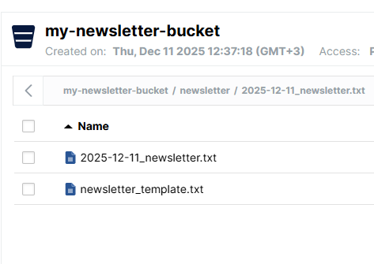

# Generate Quotes Newsletter with Apache Airflow 3.0

This tutorial demonstrates how to create an automated newsletter generation system using Apache Airflow 3.0 with assets and data-driven scheduling.

## Overview

The system consists of three main assets that work together:
1. **raw_zen_quotes**: Fetches quotes from an external API
2. **selected_quotes**: Selects three quotes (short, medium, long) from the raw data  
3. **formatted_newsletter**: Formats the selected quotes into a newsletter

## Prerequisites

- Docker and Docker Compose installed
- Apache Airflow 3.0 running (see docker-compose.yaml in parent directory)

## Step 1: Create the Raw Quotes Asset

Create the file `dags/raw_zen_quotes.py`:

```python
import os

from airflow.sdk import asset


@asset(schedule="@daily")
def raw_zen_quotes() -> list[dict]:
    """
    Extracts a random set of quotes.
    """
    import requests

    r = requests.get("https://zenquotes.io/api/quotes/random")
    quotes = r.json()

    return quotes
```

## Step 2: Create the Selected Quotes Asset

Create the file `dags/selected_quotes.py`:

```python
import os

from airflow.sdk import asset
from raw_zen_quotes import raw_zen_quotes

@asset(schedule=[raw_zen_quotes])
def selected_quotes(context: dict) -> dict:
    """
    Transforms the extracted raw_zen_quotes.
    """

    import numpy as np

    raw_zen_quotes = context["ti"].xcom_pull(
        dag_id="raw_zen_quotes",
        task_ids=["raw_zen_quotes"],
        key="return_value",
        include_prior_dates=True,
    )[0]  # [0] Added to account for a bugfix in version 3.0.1, see: https://github.com/apache/airflow/pull/49692

    quotes_character_counts = [int(quote["c"]) for quote in raw_zen_quotes]
    median = np.median(quotes_character_counts)

    median_quote = min(
        raw_zen_quotes,
        key=lambda quote: abs(int(quote["c"]) - median),
    )
    raw_zen_quotes.pop(raw_zen_quotes.index(median_quote))
    short_quote = [quote for quote in raw_zen_quotes if int(quote["c"]) < median][0]
    long_quote = [quote for quote in raw_zen_quotes if int(quote["c"]) > median][0]

    return {
        "median_q": median_quote,
        "short_q": short_quote,
        "long_q": long_quote,
    }
```

## Step 3: Create the Newsletter Formatting Asset
- Add requirements.txt and up compose --build option
`apache-airflow-providers-amazon[s3fs]`
- Create s3 connection 

    - Connection ID: s3_conn
    - Connection Type: Amazon Web Services
    - AWS Access Key Id: minioadmin
    - AWS Secret Access Key: minioadmin
    - Extra Fields:
```json
{
  "endpoint_url": "http://minio:9000"
}
```


Create the file `dags/populate_newsletter.py`:

```python
import os

from airflow.sdk import asset
from selected_quotes import selected_quotes

OBJECT_STORAGE_SYSTEM = os.getenv("OBJECT_STORAGE_SYSTEM", default="s3")
OBJECT_STORAGE_CONN_ID = os.getenv("OBJECT_STORAGE_CONN_ID", default="s3_conn")
OBJECT_STORAGE_PATH_NEWSLETTER = os.getenv(
    "OBJECT_STORAGE_PATH_NEWSLETTER",
    default="my-newsletter-bucket/newsletter",
)


@asset(
    schedule=[selected_quotes],
)
def formatted_newsletter(context: dict) -> None:
    """
    Formats the newsletter.
    """
    from airflow.sdk import ObjectStoragePath

    object_storage_path = ObjectStoragePath(
        f"{OBJECT_STORAGE_SYSTEM}://{OBJECT_STORAGE_PATH_NEWSLETTER}",
        conn_id=OBJECT_STORAGE_CONN_ID,
    )

    date = context["dag_run"].run_after.strftime("%Y-%m-%d")

    selected_quotes = context["ti"].xcom_pull(
        dag_id="selected_quotes",
        task_ids=["selected_quotes"],
        key="return_value",
        include_prior_dates=True,
    )[0]  # [0] Added to account for a bugfix in version 3.0.1, see: https://github.com/apache/airflow/pull/49692

    newsletter_template_path = object_storage_path / "newsletter_template.txt"

    # Create directory if it doesn't exist
    object_storage_path.mkdir(parents=True, exist_ok=True)
    
    # Create template file if it doesn't exist
    if not newsletter_template_path.exists():
        default_template = """Daily Newsletter - {date}

Quote of the Day #1:
"{quote_text_1}"
- {quote_author_1}

Quote of the Day #2:
"{quote_text_2}"
- {quote_author_2}

Quote of the Day #3:
"{quote_text_3}"
- {quote_author_3}

Have a great day!
"""
        newsletter_template_path.write_text(default_template)

    newsletter_template = newsletter_template_path.read_text()

    newsletter = newsletter_template.format(
        quote_text_1=selected_quotes["short_q"]["q"],
        quote_author_1=selected_quotes["short_q"]["a"],
        quote_text_2=selected_quotes["median_q"]["q"],
        quote_author_2=selected_quotes["median_q"]["a"],
        quote_text_3=selected_quotes["long_q"]["q"],
        quote_author_3=selected_quotes["long_q"]["a"],
        date=date,
    )

    date_newsletter_path = object_storage_path / f"{date}_newsletter.txt"

    date_newsletter_path.write_text(newsletter)
```

- After dag run



------

## Step 4: Understanding the Workflow

### Asset-Based Scheduling
This tutorial demonstrates Airflow 3.0's new asset-based scheduling feature:

1. **raw_zen_quotes** asset runs daily and fetches quotes from ZenQuotes API
2. **selected_quotes** asset is triggered when `raw_zen_quotes` completes
3. **formatted_newsletter** asset is triggered when `selected_quotes` completes

### Data Flow
```
ZenQuotes API → raw_zen_quotes → selected_quotes → formatted_newsletter
```

### File Structure
```
/opt/airflow/
├── dags/
│   ├── raw_zen_quotes.py
│   ├── selected_quotes.py
│   └── populate_newsletter.py
└── include/
    └── newsletter/
        ├── newsletter_template.txt
        └── {date}_newsletter.txt
```

## Step 5: Running the Pipeline

1. **Start Airflow**: Ensure your Airflow environment is running
2. **Trigger the Pipeline**: Go to Airflow UI (http://localhost:8080) and manually trigger the `raw_zen_quotes` DAG
3. **Monitor Execution**: Watch as the pipeline automatically triggers subsequent DAGs
4. **View Results**: Check the generated newsletter file

## Step 6: Viewing Generated Files

To see the generated newsletter:

```bash
# List files in newsletter directory
docker exec airflow3-airflow-scheduler-1 ls -la /opt/airflow/include/newsletter/

# View the generated newsletter
docker exec airflow3-airflow-scheduler-1 cat /opt/airflow/include/newsletter/$(date +%Y-%m-%d)_newsletter.txt
```

## Key Features Demonstrated

1. **Asset-Based Scheduling**: Modern Airflow 3.0 feature for data-driven workflows
2. **ObjectStoragePath**: Unified API for file operations across different storage systems
3. **Dynamic File Creation**: Automatically creates directories and template files
4. **External API Integration**: Fetches data from ZenQuotes API
5. **Data Processing Pipeline**: Multi-stage data transformation workflow

## Troubleshooting

### Common Issues

1. **FileNotFoundError**: The tutorial includes automatic directory and file creation
2. **Import Errors**: Ensure all DAG files are in the `/dags` folder
3. **Asset Dependencies**: Check that asset names match between DAGs
4. **API Rate Limits**: ZenQuotes API has rate limits; add appropriate delays if needed

### Debugging Tips

1. Check Airflow logs for detailed error messages
2. Verify that assets are properly defined and referenced
3. Ensure network connectivity for API calls
4. Monitor disk space for file operations

## Extension Ideas

1. **Email Notifications**: Add email sending functionality
2. **Multiple Sources**: Integrate additional quote APIs
3. **Scheduling Options**: Experiment with different schedule patterns
4. **Data Validation**: Add data quality checks
5. **Template Customization**: Create multiple newsletter templates

This tutorial provides a complete example of modern Airflow 3.0 features including assets, object storage abstraction, and automated workflow triggering.